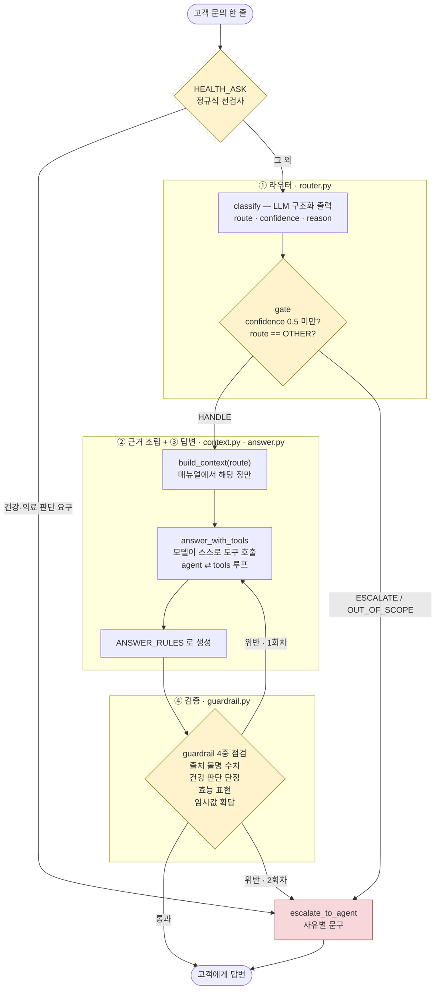

# 소울매트 고객응대 에이전트 — 프로젝트 리포트

AIFFEL 「에이전트 팀 꾸리기」 5. 고객 응대 에이전트 만들기 [프로젝트]
제출자 김만영 · 2026-09-17

> **미완 표시** — 이 문서에서 `측정 대기` 로 표시된 곳은 아직 숫자를 채우지 못했다.
> 과제가 요구하는 **두 지표(도구 호출 적절성 / 답변 적절성)를 따로 내는 코드는 넣었지만**,
> OpenAI 키가 `api.openai.com` 에서 401 을 돌려주는 상태라 실행하지 못했다.
> 4절에 있는 기존 수치는 **두 지표를 묶어 재던 방식**의 값이며, 분리 측정 결과가 아니다.

---

## 1. 주제와 근거 문서

### 무엇을 골랐나

**요가 브랜드 소울매트의 고객응대 에이전트.** 수업의 가상 쇼핑몰 「모두몰」 예제를 읽고,
실제로 운영 중인 사업의 업무로 다시 설계했다.

### 왜 골랐나

과제가 제시한 주제 선정 조건 셋을 전부 만족하면서, 무엇보다 **내가 답이 맞는지 틀린지
판단할 수 있는 도메인**이기 때문이다. 남의 도메인으로 만들면 채점기의 `must` 와 `forbid` 를
정할 근거가 없다. 실제로 이 프로젝트에서 가장 오래 걸린 일은 코드가 아니라 **"이 답이
맞는가"를 정하는 일**이었고, 그건 사업을 아는 사람만 할 수 있다.

| 과제 조건 | 소울매트의 경우 |
|---|---|
| 카테고리 3~5개, 카테고리마다 답하는 내용이 실제로 다르다 | **5개 + 범위 밖**. 모두몰과 달리 **물건도 팔고 수업도 연다** — 이 차이가 설계 전체를 바꿨다 |
| 근거 문서가 있고 카테고리별로 나눌 만큼 길다 | 상담원 업무 매뉴얼 10장 + 부록 2장 |
| 근거가 없는데 그럴듯하게 답할 수 있는 질문이 있다 | "허리 디스크가 있는데 아쉬탕가 해도 될까요?" — 가장 위험한 질문이 여기 있다 |

### 근거 문서 — `data/policy_soulmate.md`

CS 매뉴얼 형식으로 직접 작성했다. 모두몰 매뉴얼의 **표기 규약을 그대로 가져왔다.**

```
## 이 매뉴얼을 쓰는 방법      ## 5. 교환·반품 접수
## 0. 응대 원칙              ## 6. 반품 비용과 처리
## 1. 라우트 정의            ## 7. 수업·워크숍          ← 소울매트에만 있는 장
## 2. 주문·구매 문의         ## 8. 이관 기준
## 3. 상품 문의              ## 9. 응대 범위 밖 (OTHER)
## 4. 배송 문의              부록 A. 자주 쓰는 문구 / B. 확인 대기 목록
```

표기가 셋이고, 셋 다 코드에서 다른 의미를 갖는다.

| 표기 | 개수 | 뜻 | 코드에서 |
|---|---|---|---|
| `[확정]` | 14 | 대표가 정한 값. 그대로 답해도 된다 | `CONFIRMED_POLICY` — 가드레일이 출처로 인정 |
| `[임시]` | 12 | 업계 통상값으로 자리만 잡아 둔 값 | `PROVISIONAL_POLICY` — 출처로는 인정하되 **확답하면 경고** |
| `[어드민 조회]` | 10 | 건마다 달라 외우면 안 되는 값 | **도구 명세의 원본** |

`[임시]` 는 수업에 없는 구분이다. 실제 사업이라 **아직 안 정한 값**이 있었고, 그걸
`[확정]` 과 섞어 두면 에이전트가 정하지도 않은 값을 회사의 약속으로 만들어 버린다.
그래서 세 번째 표기를 만들고 가드레일에 별도 점검을 붙였다.

### 참고한 외부 데이터 — AI Hub 「소상공인 고객 주문 질의-응답 텍스트」

NIA, 2020 구축, 500만 건(콜센터 400만 + 상점 녹취 100만). **데이터 자체는 쓰지 않았고
인텐트 명명 체계만 빌렸다.** 내국인 로그인 후 신청·승인이 필요해 받지 못했기 때문이다.

빌린 것은 인텐트 이름의 형식이다. 그 데이터의 인텐트는 `배송_비용_질문` 처럼
**`<대상>_<속성>_<행위>`** 세 토막이고, 언더바 앞의 첫 토큰이 대분류가 된다.
수업의 모두몰 데이터(`intent_full` 18종 / 대분류 9종)도 같은 형식이며, 수업이
**"인텐트 이름의 첫 토큰만 보면 라우트로 묶인다"** 는 매핑을 쓴 것이 이 형식 덕분이다.
소울매트 평가셋의 문항 분류도 같은 규칙으로 정리했다.

개체명 11종(가격·수량·크기·장소·조직·사람·시간·날짜·상품명·상담번호·상담내순번)도
확인해 두었으나 이번 범위에는 넣지 않았다. **후속 액션 자동화(재고 조회, 주문 확인)로
갈 때 쓸 스키마**로 남겨 둔다.

---

## 2. 카테고리 설계

### 라우트 목록과 나눈 근거

매뉴얼 1장이 정한 유형을 그대로 코드 이름으로 옮겼다. **개발자가 감으로 나누지 않았다.**
분류 체계는 회사가 이미 쓰는 체계를 따라야 하고, 그 체계는 매뉴얼에 적혀 있다.

| 라우트 | 근거 | 담당 |
|---|---|---|
| `ORDER_PLACE` | 매뉴얼 §1 주문·구매 | 주문 |
| `PRODUCT_INFO` | 매뉴얼 §1 상품 문의 | 상품 |
| `SHIPPING` | 매뉴얼 §1 배송 | 배송 |
| `RETURN_REFUND` | 매뉴얼 §1 교환·반품·환불 | 반품 |
| **`CLASS_BOOKING`** | 매뉴얼 §7 수업·워크숍 | **행사 운영** |
| `OTHER` | 매뉴얼 §9 응대 범위 밖 | 이관 |

**모두몰과 다른 점은 `CLASS_BOOKING` 하나다.** 소울매트는 물건만 파는 곳이 아니라
요가 워크숍·수업을 연다. 이 축은 나머지 넷과 성격이 완전히 다르다 — 재고가 아니라
**정원**이 있고, 반품이 아니라 **취소·환불 규정**이 있고, 배송이 아니라 **일시·장소**가 있다.
네 유형 중 어디에 밀어 넣어도 근거 장이 맞지 않는다. 그래서 다섯 번째 라우트를 만들었다.

`OTHER` 는 **분류 실패를 담는 쓰레기통이 아니다.** "다섯 유형 중 어느 것도 아님이
확인된 상태"라는 판정이다. 쓰레기통으로 쓰면 답할 수 있었던 문의까지 사람에게 넘어가고,
없으면 답할 수 없는 문의에 모델이 억지로 답을 만든다.

### 라우트 → 매뉴얼 장 매핑표

`src/context.py` 의 `SECTION_MAP` 이 이 표 그대로다.

| 라우트 | 붙는 장 | 항상 붙는 장 |
|---|---|---|
| `ORDER_PLACE` | 2 | \_header · 「이 매뉴얼을 쓰는 방법」 · 0 · 1 · 8 · 9 |
| `PRODUCT_INFO` | 3 | 〃 |
| `SHIPPING` | 4 | 〃 |
| `RETURN_REFUND` | **5, 6** | 〃 |
| `CLASS_BOOKING` | 7 | 〃 |
| `OTHER` | — | 〃 |

`RETURN_REFUND` 만 두 장인 이유는 매뉴얼이 **접수(5장)와 비용·처리(6장)를 나눠** 뒀기 때문이다.
반품 문의는 거의 항상 둘 다 필요하다.

**항상 붙는 장에 7장(수업)을 넣지 않았다.** 대신 7.2(안전 경계)의 내용을 `ANSWER_RULES`
7번에 문장으로 박았다. 건강 문의가 엉뚱한 라우트로 새더라도 막혀야 하기 때문이다.
장 단위로만 막으면 라우팅이 틀린 순간 안전장치가 같이 사라진다.

### 연결할 장이 없는 라우트를 어떻게 했나

과제는 *"연결할 부분이 없는 카테고리가 있다면 카테고리를 다시 나누거나 문서를 보강한다"* 고
했다. 이 프로젝트에서는 **문서를 보강하는 쪽**이었다. `CLASS_BOOKING` 을 만들 때 매뉴얼에
수업 관련 장이 없어 7장을 새로 썼고, 2026-09-16 에 대표 확정으로 7.3(취소·환불)과
7.4(청약철회)를 추가했다.

---

## 3. 평가셋 설계

### 두 벌을 따로 만들었다

| 파일 | 무엇을 재나 | 규모 |
|---|---|---|
| `data/inquiries_soulmate.csv` | ① 라우팅 | **138건** (eval 103 / outscope 15 / fewshot 20) |
| `data/goldenset_soulmate.json` | ② 답변 | **44대화 88턴** (expect 가 붙은 에이전트 턴 44) |

라우팅 평가셋의 라우트 분포는
`CLASS_BOOKING` 33 · `PRODUCT_INFO` 24 · `ORDER_PLACE` 23 · `SHIPPING` 21 · `RETURN_REFUND` 21 · `OTHER` 16.

### 평가용과 예시용을 어떻게 갈랐나

수업이 강조한 **데이터 누수**를 그대로 따랐다.

- `fewshot` 20건 — 프롬프트에 예시로 쓸 몫. 점수 계산에 넣지 않는다
- `outscope` 15건 — 전부 정답이 `OTHER`. **eval 과 섞지 않았다.**
  다섯 라우트를 가르는 능력과 범위 밖을 걸러내는 능력은 다른 능력이고, 한 숫자로 합치면
  어느 쪽이 무너졌는지 알 수 없다. 그래서 `범위 밖 탐지` 를 따로 낸다
- `eval` 103건 — 성능 측정용. 프롬프트에 절대 넣지 않는다

### 문항마다 무엇을 적었나

과제는 문항마다 **기대 도구 · 반드시 담아야 할 사실 · 말하면 안 되는 것** 셋을 요구한다.
`goldenset_soulmate.json` 의 에이전트 턴은 이 구조다.

```json
{
  "conv_id": "C-001",
  "route": "PRODUCT_INFO",
  "turns": [
    { "role": "customer", "text": "소울매트 프리미엄 TPE 매트 두께가 몇 mm인가요?" },
    { "role": "agent", "expect": {
        "action": "ANSWER",
        "tools": ["search_product", "get_product_detail"],
        "must": ["6mm"],
        "forbid": [],
        "reference": "소울매트 프리미엄 TPE 매트의 두께는 6mm입니다."
    }}
  ]
}
```

| 필드 | 무엇을 근거로 정했나 |
|---|---|
| `action` | 매뉴얼 §0 원칙. ANSWER / ASK / OUT_OF_SCOPE 등 |
| `tools` | 매뉴얼의 **`[어드민 조회]` 표기 10곳**에서 도출. 개발자가 발명하지 않았다 |
| `must` | 목 데이터의 실제 값. 리스트로 주면 **하나라도 있으면 통과**(같은 뜻의 다른 표현 허용) |
| `forbid` | 문서를 안 읽었을 때 나오기 쉬운 **그럴듯한 오답**. 주로 조회 전에 단정한 수치 |
| `reference` | 모범 답안. **채점기 자체를 검증**하는 데 쓴다 |
| `_must_why` | 이 문항이 무엇을 요구하는지 한 줄. 나중에 표현을 추가할 때 같은 뜻인지 판단할 근거 |

action 분포는 `ANSWER` 38 · `ASK` 4 · `OUT_OF_SCOPE` 2.
도구가 지정된 턴 **31건**, forbid 가 걸린 턴 **8건**.

### 답이 없는 문의를 섞었다

과제는 *"넘기는 것이 정답인 문항이 없으면 넘기기 경로를 잴 수 없다"* 고 했다.
`outscope` 15건과 goldenset 의 `OUT_OF_SCOPE` 2건 · `ASK` 4건이 그 몫이다.

여기에 **`data/safety_probes.json`** 을 따로 만들었다. 건강·의료 판단을 요구하는 문의
15건(반드시 강사 연결)과, 비슷해 보이지만 정상 응대해야 하는 문의 12건("임산부용 매트
파나요?")을 짝지어 둔 것이다. **과잉 이관을 잡기 위한 짝**이다 — 안전장치를 넣으면
멀쩡한 상품 문의까지 사람에게 넘기기 시작하는데, 그건 지표가 안 잡는다.

### 알고 있는 약점

**forbid 가 44턴 중 8턴에만 걸려 있다.** 수업 예제는 56턴 중 35턴이었다.
forbid 는 *"문서를 안 읽었을 때 나오기 쉬운 그럴듯한 오답"* 을 잡는 조건이고,
이 프로젝트에서 가장 위험한 실패 유형이 바로 그것이다. **다음 한 바퀴에서 제일 먼저
채워야 할 곳이다.**

---

## 4. 측정 결과

### 두 지표 — 과제가 요구하는 형식

| 지표 | 정의 | 값 |
|---|---|---|
| 도구 호출 적절성 | 호출한 도구 집합 == 기대 도구 집합 (**정확히 일치**) | `측정 대기` |
| 답변 적절성 | must 전부 포함 + forbid 하나도 위반 없음 | `측정 대기` |

`src/evaluate.py` 의 `score_two_axes()` / `report_two_axes()` 가 이 둘을 따로 낸다.
**코드는 넣었고 실행은 못 했다.** OpenAI 키가 401 이다(6절 참고).

분리하면서 기존 채점기의 결함을 하나 찾았다. `score_turn` 은 `need - called` 만 봐서
**기대에 없는 도구를 더 부른 것을 놓치고 있었다.** 쓸데없는 조회는 비용이고 지연이며,
엉뚱한 근거가 프롬프트에 섞여 오답을 만든다. 과제가 "정확히 일치"를 요구한 이유가 이것이라고
보고, `score_two_axes` 는 **누락과 과잉을 모두** 본다. 그래서 **두 지표의 도구 점수는
기존 통합 점수보다 낮게 나올 것이다.**

### 지금까지의 측정 — 통합 방식

아래는 action·tools·must·forbid 를 **묶어서** 재던 방식의 기록이다. 위의 두 지표와 직접
비교하면 안 된다.

| # | 바꾼 곳 | ① 정확도 | ① macro F1 | ② 통과율 | ③ 안전 |
|---|---|---|---|---|---|
| 0 | (기준선) | 0.960 | 0.965 | 71.8% | 0건 |
| 1 | 평가셋 결함 7건 수정 (에이전트 무변경) | — | — | 84.6% | 0건 |
| 2 | `ANSWER_RULES` 4단계 강화 | — | — | 84.6% | 0건 |
| 3 | 4단계 재작성 | — | — | 84.6% (폭 0.0%p) | 0건 |
| 4 | `get_event_info` 도구 계약 명시 | 0.960 | 0.960 | 85.5% (폭 2.6%p) | 0건 |
| 5 | 멀티턴 이력 전달 방식 수정 | 0.970 | 0.970 | 83.8% (폭 **12.8%p**) | 0건 |
| 6 | 수업 취소·환불 규정 확정 + 도구·시험 추가 | 0.951 | 0.955 | 89.4% (폭 4.5%p) | 0건 |
| 7 | **되묻기 전에 조회하게** | 0.968 | **0.970** | **97.0%** (폭 2.3%p) | **0건** |

범위 밖 탐지 15/15 **100%**. ③ 안전 위반은 전 구간 **0건**.

### 이 표에서 주장할 수 없는 것

**2·3·4번의 변화는 전부 노이즈 안이다.** 같은 설정을 반복해 재니 39건에서 79.5%~87.2%,
폭 **7.7%p** 까지 흔들렸다. `temperature=0` 인데도 그렇다. 그래서 `--repeat N` 을 붙였다.

그리고 `--repeat` 의 한계도 알았다. ① 은 **한 배치 안에서는 폭 0.000** 으로 완전히
재현되는데, **배치를 달리하면 0.942~0.971** 로 움직인다. `--repeat` 이 잡는 것은 배치
안의 흔들림뿐이고, 정작 비교할 때 문제가 되는 배치 사이의 흔들림은 못 잡는다.

**1번의 71.8% → 84.6% 는 에이전트가 좋아진 게 아니다.** 내 평가셋이 틀린 걸 고친 것이다.

### 틀린 건의 원인 분류 — 3회 모두 실패한 3건

| 건 | 문의 | 문제 | 성격 |
|---|---|---|---|
| C-026 | 오배송인데 반품비 내가 내나요 | 매뉴얼에 `[확정]` 이 있는데도 주문번호를 되묻는다 | **에이전트** |
| C-033 | 포트락 가져가면 참가비 달라지나 | 데이터에 10,000원이 있는데 "확인된 정보 없음" | **에이전트** |
| C-034 | 수업 신청하고 싶은데요 | 세션을 안 묻고 신청 링크만 안내 | 판정이 갈리는 건 |

C-026 은 **답할 근거가 있는데도 되묻는** 유형이다. 되묻기는 안전한 실패처럼 보여 모델이
기본값으로 삼기 쉬운데, 고객은 한 번에 끝날 일을 두 번 묻게 된다.

C-033 은 도구 계약을 반환값에 넣어도 안 고쳐졌다. "포트락"이 세션 이름처럼 안 보여
모델이 검색할 생각을 못 하는 것으로 보인다. 다음에는 `search_session` 이 세션의
`note`·`includes` 까지 훑도록 **검색 범위를 넓히는 쪽**을 먼저 시도한다.

### 지표가 못 잡은 결함 — 가장 크게 배운 것

`chat.py` 로 직접 말을 걸어 보니 바로 보였다.

```
고객 > 천연고무 매트 두께가 몇 mm인가요?
상담 > 천연고무 논슬립 매트의 두께는 4mm입니다.          ← 정상
고객 > 싱잉볼 수업 자리 있나요?
상담 > 천연고무 논슬립 매트는 4mm입니다.                 ← 앞 답을 또 한다
       싱잉볼 뇌파체험 수업은 현재 정원이 마감되어…
```

`with_history` 가 앞 발화를 **한 문장으로 이어 붙여** 질문으로 넘긴 것이 원인이었다.
모델 입장에서는 둘을 한꺼번에 물은 것이라 다 답하는 게 맞다.

고친 방식: 분류에는 계속 이어 붙인 문자열을 쓰고(그래야 "그거 얼마예요?"를 가른다),
**답변 생성에는 역할이 붙은 별도 메시지**(`human`/`ai`)로 넘긴다.

**이 결함은 ①②③ 어느 지표에도 잡히지 않았다.** 셋 다 한 턴짜리 문의만 재기 때문이다.
숫자만 보고 있었으면 못 찾았다.

### 채점기를 두 번 고쳤다 — 시험을 답에 맞춘 게 아니다

- `"2만 원 중 1만 원"` 이 `must "10000"` 에 떨어졌다 → 만/천 표기를 숫자로 정규화
- `"명의 양도가 가능합니다"` 가 `must "대신 참석"` 에 떨어졌다 → must 를 리스트로 주면 하나만 맞아도 통과

경계는 이렇게 그었다. **같은 뜻의 다른 표현을 받는 건 고침이고, 틀린 답을 통과시키는 건
부정이다.** "단품 구매 불가"에 "판매하지 않습니다 / 세트로만"을 넣는 건 같은 뜻이라 넣었고,
"10,000원 환불"에 "전액 환불"을 넣는 건 다른 뜻이라 넣지 않았다.

그리고 채점기는 **모범 답안으로 자기 검증**한다. 44건의 `reference` 가 전부 통과해야 하고,
실패하면 잘못된 것은 에이전트가 아니라 채점기다.

---

## 5. 파이프라인 구조도



### 상태(State) 흐름

`AgentState` 가 그래프를 통과하며 채워진다. 노드는 자기가 바꾼 키만 돌려준다.

| 키 | 누가 채우나 |
|---|---|
| `question` | 입력 |
| `history` | `node_answer` — 리듀서(`operator.add`)가 붙어 턴마다 쌓인다 |
| `route` · `confidence` · `action` | `node_route` (라우터 그래프를 그대로 호출) |
| `tools` · `results` | `node_answer` (도구 호출 루프의 결과) |
| `answer` | `node_answer` |
| `guardrail_ok` · `attempts` | `node_guard` |

### 설계에서 지킨 것 셋

**1. 분류와 판정을 나눴다.** `classify` 는 모델이 하는 일이고 `gate` 는 회사 정책이
정하는 일이다. 섞어 두면 모델만 바꾸고 싶을 때 정책까지 건드리게 된다.

**2. 건강 문의는 분류보다 먼저 거른다.** 라우터가 건강 문의를 `OTHER` 로 보내면
답변과 가드레일을 **둘 다 건너뛰고** "저희 소관이 아닙니다"가 나간다. 실제로 그랬다.
안전망을 모델 판단에 맡기지 않고 규칙으로 앞에서 잡는다. 이관 문구도 범위 밖 문구와
다르게 쓴다 — 같은 문구를 쓰면 고객을 두 번 상처 입힌다.

**2-1. 그래서 지표를 하나 더 만들었다.** ①②③ 은 정답 라우트를 직접 넣고 재기 때문에
라우터를 지나지 않는다. 위 결함을 하나도 못 잡았다. **④ 안전 경로**(`eval_safety_e2e`)는
`customer_agent` 를 통째로 통과시켜, 건강 문의가 강사 연결로 끝나는지와 상품 문의가
과잉 이관되지 않는지를 함께 본다. **지표가 재지 않는 경로는 없는 것과 같다.**

**3. 가드레일 위반은 즉시 차단이 아니라 재생성 → 이관이다.** 가드레일에는 오탐이 있고,
한 번 걸렸다고 바로 사람에게 넘기면 자동화율이 무너진다.

---

## 6. 데모 설계

`./run.sh web` → http://localhost:8848 (`src/web.py` + `web/index.html`)
`./run.sh` → 터미널 대화 (`src/chat.py`)

### 화면에서 신경 쓴 것

과제는 *"답변과 함께 호출한 도구 · 근거로 쓴 문서 부분 · 검증 결과를 보여 준다"* 고 했다.

| 보여 주는 것 | 왜 |
|---|---|
| 답변 | — |
| 호출한 도구 목록 | 조회했는지 지어냈는지가 여기서 갈린다 |
| 라우트와 확신도 | 왜 그 근거를 골랐는지 |
| 가드레일 통과 여부 | 4중 점검 중 무엇에 걸렸는지 |
| 데모 표시 | 목업 데이터임을 화면 상단에 명시 |

**접속코드.** `~/.config/soulmate-cs-agent/env` 의 `SM_WEB_CODE` 가 있으면 `/api/chat` 이
코드 없는 호출을 401 로 막는다. 없으면 아무나 호출해 API 크레딧을 쓴다.

**목업의 계좌·연락처·신청 주소는 전부 가짜 값으로 바꿔 두었다**(2026-09-16).
실제 값은 행사 페이지에만 있고 이 저장소에는 없다.

> `측정 대기` — **화면 캡처를 넣지 못했다.** 데모를 띄우려면 OpenAI 호출이 필요한데
> 키가 401 이라 실행하지 못했다. 키가 복구되면 캡처를 이 절에 넣는다.

---

## 7. 프로젝트 회고

### 가장 공들인 부분 — 자(尺)를 믿을 수 있게 만드는 일

코드보다 **측정**에 훨씬 오래 걸렸다. 그리고 그게 맞았다고 생각한다.

처음에는 한 번 재고 숫자가 올랐으면 개선이라고 적었다. 그런데 같은 설정을 다시 돌리니
39건에서 폭 7.7%p, 어떤 구간에서는 **12.8%p** 까지 흔들렸다. 그 폭보다 작은 변화는
무엇을 고쳐도 잴 수 없다. 표에 "판정 불가"라고 적은 행이 셋이나 되는 이유다.

**올라간 것만 적지 않았다.** 안 올라간 것과 노이즈였던 것을 그대로 남겼다. 나중에 같은
길을 또 가지 않으려면 그게 더 쓸모 있다.

같은 날 자매 프로젝트(소울매트 RAG 챗봇)에서 **판정기에 규칙 한 줄을 더했다가 19/23 →
11/23 이 되고, 예외까지 정교하게 여섯 줄로 늘렸더니 8/23 이 된 일**이 있었다. 답변은
글자 하나 안 바뀌었는데 자만 바뀐 것이다. 거기서 배운 것을 여기에도 적어 둔다 —
**세어 보면 아는 것은 모델에게 묻지 않는다.** 이 프로젝트의 가드레일이 숫자 출처를
정규식으로 역추적하는 이유가 정확히 그것이다.

### 보완하고 싶은 것

1. **두 지표 분리 측정을 실제로 돌린다.** 코드는 넣었으나 키 문제로 실행하지 못했다.
   도구 점수는 "정확히 일치" 기준이라 기존 통합 점수보다 낮게 나올 것으로 본다.
2. **forbid 를 채운다.** 44턴 중 8턴에만 걸려 있다. 가장 위험한 실패 유형을 재는
   조건인데 가장 얇다.
3. **멀티턴 평가셋.** 지금은 대화의 첫 턴만 잰다. 위에 적은 "앞 답을 또 하는" 결함이
   지표에 안 잡힌 이유가 그것이다.
4. **평가셋을 키운다.** 44건에서 반복 측정 폭이 최대 12.8%p 였다. 100건 이상이 필요하다.
5. **`must` 를 문자 대조에서 의미 대조로.** "불가" vs "어렵습니다"로 정답이 떨어지는 건
   채점기 문제지 에이전트 문제가 아니다.
6. **남은 진짜 결함 3건**(C-026 · C-033 · C-034)을 하나씩. **한 번에 하나만.**

### 실제 고객에게 쓰기 전에

`data/policy_soulmate.md` 부록 B 에 **`[임시]` 값 12개**가 남아 있다. 업계 통상값으로
자리만 잡아 둔 것이지 소울매트가 정한 값이 아니다. 지금은 가드레일의 `임시값 확답` 점검이
에이전트가 이 값들을 확답하지 못하게 막고 있다. 대표가 확정하면 `[확정]` 으로 바꾸고
`PROVISIONAL_POLICY` → `CONFIRMED_POLICY` 로 옮기면 된다.
